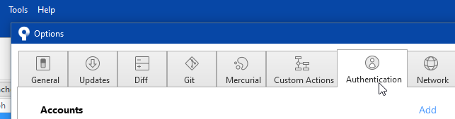

I basically followed [Create & Deploy Your Website Quickly - Docusaurus & GitHub Pages - YouTube](https://www.youtube.com/watch?v=9iVNf0T09dE)

but used [Sourcetree | Free Git GUI for Mac and Windows (sourcetreeapp.com)](https://www.sourcetreeapp.com/) for git operations.

so:

- [Sourcetree offers you to choose CredentialHelperSelector - Stack Overflow](https://stackoverflow.com/questions/63635094/sourcetree-offers-you-to-choose-credentialhelperselector)
- [[SRCTREEWIN-12719\] Missing OAUTH scope - Create and track feature requests for Atlassian products.](https://jira.atlassian.com/browse/SRCTREEWIN-12719)

:::info 

### Quick setup — if you’ve done this kind of thing before
````
[ Set up in Desktop](x-github-client://openRepo/https://github.com/PackElend/ourlife40ed)
````

or	
HTTPS: https://github.com/PackElend/ourlife40ed.git
SSH: git@github.com:PackElend/ourlife40ed.git

Get started by [creating a new file](https://github.com/PackElend/ourlife40ed/new/main) or [uploading an existing file](https://github.com/PackElend/ourlife40ed/upload). We recommend every repository include a [README](https://github.com/PackElend/ourlife40ed/new/main?readme=1), [LICENSE](https://github.com/PackElend/ourlife40ed/new/main?filename=LICENSE.md), and [.gitignore](https://github.com/PackElend/ourlife40ed/new/main?filename=.gitignore).

:::

### …or create a new repository on the command line
```bash
echo "# ourlife40edold" >> README.md
git init
git add README.md
git commit -m "first commit"
git branch -M main
git remote add origin https://github.com/PackElend/ourlife40ed.git or git@github.com:PackElend/ourlife40ed.git
git push -u origin main
```

### …or push an existing repository from the command line

```bash
git remote add origin https://github.com/PackElend/ourlife40ed.git or git@github.com:PackElend/ourlife40ed.git
git branch -M main
git push -u origin main
```

### …or import code from another repository
You can initialize this repository with code from a Subversion, Mercurial, or TFS project.


# first DEPLOY 

don't forget [node.js - 'yarn' is not recognized as an internal or external command, operable program or batch file - Stack Overflow](https://stackoverflow.com/questions/65502365/yarn-is-not-recognized-as-an-internal-or-external-command-operable-program-or)


```bash
C563368@DTCHZURNB008596 MINGW32 ~/Code/Docusaurus/ourlife40ed (main)
$ GIT_USER=PackElend yarn deploy
yarn run v1.22.19
$ docusaurus deploy
[WARNING] When deploying to GitHub Pages, it is better to use an explicit "trailingSlash" site config.
Otherwise, GitHub Pages will add an extra trailing slash to your site urls only on direct-access (not when navigation) with a server redirect.
This behavior can have SEO impacts and create relative link issues.

[INFO] Deploy command invoked...
[INFO] organizationName: PackElend
[INFO] projectName: ourlife40ed
[INFO] deploymentBranch: gh-pages
[INFO] Remote repo URL: https://PackElend@github.com/PackElend/ourlife40ed.git
c4e3c5f29b8068d699a0b1e124cfbce9b9d3daa0
[INFO] `git rev-parse HEAD` code: 0
[INFO] [en] Creating an optimized production build...
i Compiling Client
i Compiling Server
√ Client: Compiled successfully in 52.88s
√ Server: Compiled successfully in 55.49s
[SUCCESS] Generated static files in "build".
[INFO] Use `npm run serve` command to test your build locally.
Cloning into 'C:\Users\c563368\AppData\Local\Temp\ourlife40ed-gh-pagesrl1fmN'...
warning: Could not find remote branch gh-pages to clone.
fatal: Remote branch gh-pages not found in upstream origin
[INFO] `git clone --depth 1 --branch gh-pages https://PackElend@github.com/PackElend/ourlife40ed.git "C:\Users\c563368\AppData\Local\Temp\ourlife40ed-gh-pagesrl1fmN"` code: 128
Initialized empty Git repository in C:/Users/c563368/AppData/Local/Temp/ourlife40ed-gh-pagesrl1fmN/.git/
hint: Using 'master' as the name for the initial branch. This default branch name
hint: is subject to change. To configure the initial branch name to use in all
hint: of your new repositories, which will suppress this warning, call:
hint:
hint:   git config --global init.defaultBranch <name>
hint:
hint: Names commonly chosen instead of 'master' are 'main', 'trunk' and
hint: 'development'. The just-created branch can be renamed via this command:
hint:
hint:   git branch -m <name>
[INFO] `git init` code: 0
Switched to a new branch 'gh-pages'
[INFO] `git checkout -b gh-pages` code: 0
[INFO] `git remote add origin https://PackElend@github.com/PackElend/ourlife40ed.git` code: 0
warning: LF will be replaced by CRLF in 404.html.
The file will have its original line endings in your working directory
warning: LF will be replaced by CRLF in assets/js/main.66f140fd.js.
The file will have its original line endings in your working directory
warning: LF will be replaced by CRLF in assets/js/main.66f140fd.js.LICENSE.txt.
The file will have its original line endings in your working directory
warning: LF will be replaced by CRLF in blog/archive/index.html.
The file will have its original line endings in your working directory
warning: LF will be replaced by CRLF in blog/atom.xml.
The file will have its original line endings in your working directory
warning: LF will be replaced by CRLF in blog/first-blog-post/index.html.
The file will have its original line endings in your working directory
warning: LF will be replaced by CRLF in blog/index.html.
The file will have its original line endings in your working directory
```

[[SRCTREEWIN-12719\] Missing OAUTH scope - Create and track feature requests for Atlassian products.](https://jira.atlassian.com/browse/SRCTREEWIN-12719)

deleted all accounts in SourceTree
Control Panel\All Control Panel Items\Credential Manager





```bash
Deploy to GitHub Pages
failed 10 minutes ago in 9s
Search logs
2s
1s
5s
Run actions/setup-node@v3
Attempting to download 18...
Acquiring 18.7.0 - x64 from https://github.com/actions/node-versions/releases/download/18.7.0-2744549059/node-18.7.0-linux-x64.tar.gz
Extracting ...
/usr/bin/tar xz --strip 1 --warning=no-unknown-keyword -C /home/runner/work/_temp/4b1d5155-cf11-445d-b7b1-80e9b5c7d967 -f /home/runner/work/_temp/655ff1f3-657b-401f-89e9-6b5818d9a8f5
Adding to the cache ...
Done

/usr/local/bin/yarn --version
1.22.19
/usr/local/bin/yarn cache dir
/home/runner/.cache/yarn/v6
Error: Dependencies lock file is not found in /home/runner/work/ourlife40ed/ourlife40ed. Supported file patterns: yarn.lock
```

